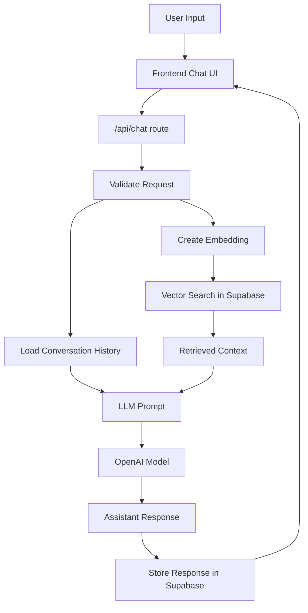
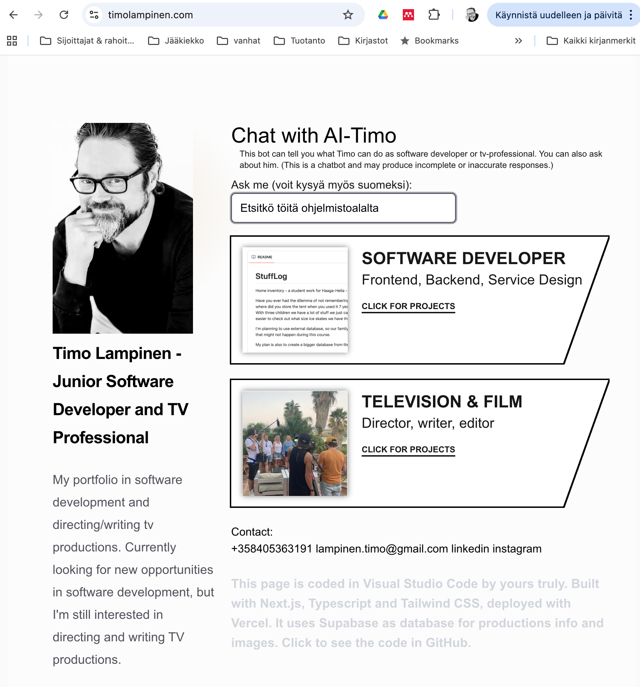
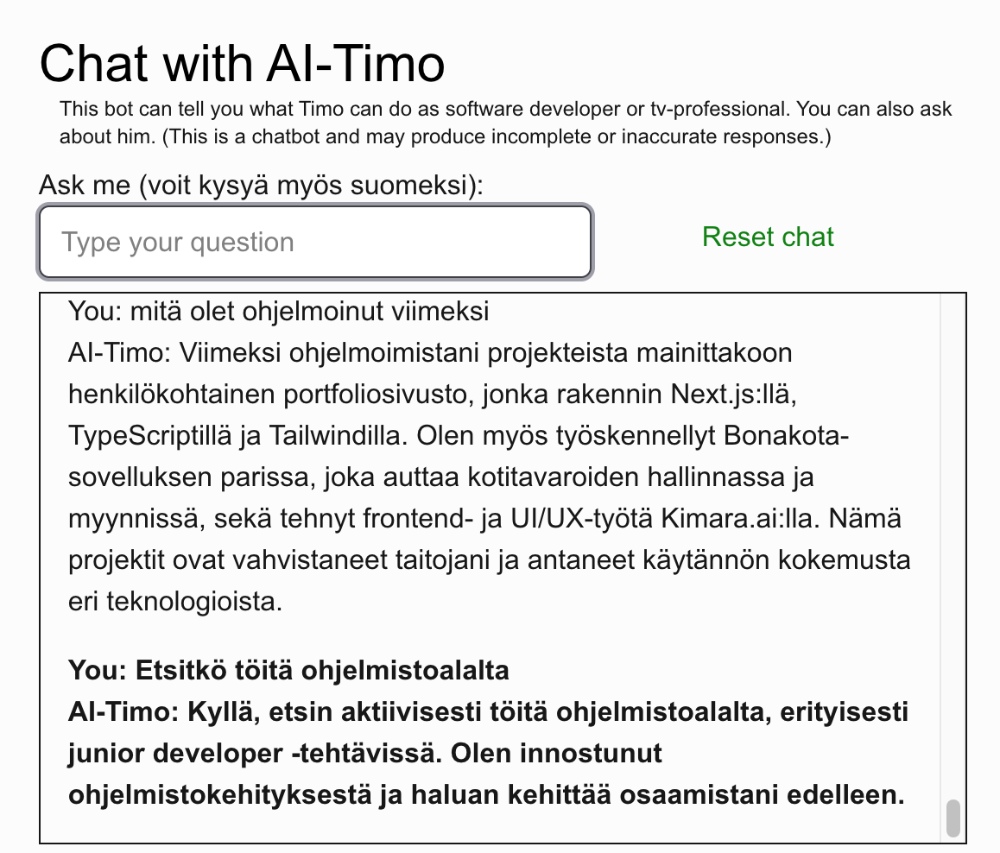

# This document describes the creation of the AI-Timo chatbot as a seminar project

This document has been translated from Finnish into English from the file seminaarityo.md using the ChatGPT-5.5 language model.

The chatbot is a seminar project for the Haaga-Helia University of Applied Sciences course Software Development Technologies (spring 2026).  
The course page can be found at [https://github.com/haagahelia/ohke-teknologiat](https://github.com/haagahelia/ohke-teknologiat).

This seminar project was created by Haaga-Helia student Timo Lampinen.

Link to video [Chatbot presentation video inyoutube](https://youtu.be/jlgG4DOlAi4)  
Link to code in Github repository [timo-portfolio github code](https://github.com/Hirvilampi/timo-portfolio/)  

**Table of Contents**

- [Chatbot Project and Purpose](#chatbot-project-and-purpose)
- [Technologies Used](#technologies-used)
- [How the Chatbot Works](#how-the-chatbot-works)
- [Chatbot Files and What They Do](#chatbot-files-and-what-they-do)
- [Database and Its Functionality](#database-and-its-functionality)
- &nbsp;&nbsp;&nbsp;&nbsp;[conversations & messages](#conversations--messages)
- &nbsp;&nbsp;&nbsp;&nbsp;[RAG - document_chunks_fin](#rag---document_chunks_fin)
- &nbsp;&nbsp;&nbsp;&nbsp;[matchDocumentChunksFin - SQL database function](#matchdocumentchunksfin---sql-database-function)
- [Reflection](#reflection)
- [Sources](#sources)


## Chatbot Project and Purpose

My goal was to build a chatbot called Timo that works on my portfolio site. The chatbot answers questions  
about my work experience, studies, TV projects, coding projects, myself, and of course the creation of this chatbot.

I chose a chatbot because I wanted to learn how to use a large language model in practice. At the same time, I could add a working element to my site that is also able to provide more information about me.

## Technologies Used

next.js - Next.js works as the foundation of the entire portfolio  
typescript and tailwind - programming language and styling  
vercel.com - the portfolio runs on Vercel and is pointed there with CNAME settings  
Vercel AI SDK - the tools used to build the chatbot  
gpt-4o-mini-2024-07-18 - the OpenAI language model used to generate responses  
text-embedding-3-small - the OpenAI embedding model that turns text into numerical vectors. These vectors are used for RAG search  
supabase - the database where the RAG data and the chat questions and answers are stored

**Why I chose these technologies**

I had already built my portfolio using the combination of Next.js, Supabase, and Vercel, so I was able to focus more effort on the actual topic, the chatbot itself. In the same environment these technologies also work well together.  
At the same time, TypeScript and Tailwind were already familiar to me.

When I started building the chatbot, I found the AI Hero video series, which explained how to use the Vercel AI SDK. Since I was already using Vercel as a platform, I decided to adopt that technology. That tutorial became the main external source during the development of the application.

Vercel AI SDK tutorial on AIHero  
https://www.aihero.dev/tool-calls-with-vercel-ai-sdk

My portfolio already used Supabase, and when I noticed that it also supports RAG databases, I decided to use Supabase.

Supabase documentation  
https://supabase.com/docs/guides/ai  
https://supabase.com/docs/guides/ai/examples/nextjs-vector-search  
  
I chose this OpenAI language model because it is very inexpensive to use, while still being able to produce good-quality responses. I also felt it made sense to learn how to use the language model API directly. To illustrate the cost, I have used 397,000 tokens so far and it has cost 18 cents.

OpenAI Developers documentation  
https://developers.openai.com/api/docs  


## How the Chatbot Works

In simplified form, the chatbot receives the user’s question, loads the earlier conversation history, and validates that a question exists. An embedding is created from the latest question using the embedding model that was selected earlier. A RAG search is then performed in the database using that embedding. The question, conversation history, the context returned by the RAG search, and the prompt that contains the response instructions are sent to the language model. The language model returns a response, which is then shown to the user.

The Mermaid diagram below shows clearly how the process moves forward.



The chatbot first opens as part of the portfolio. The user can write a question in the question box.  

  

The answer opens a window where the user can browse the conversation history. The newest question and answer are shown in bold.  

  

After this, the conversation can be continued by writing a new question in the question box.  
  

## Chatbot Files and What They Do

This is also my portfolio, so there are many files and directories in the project. The following files are used by the chatbot.

Path to the standalone chatbot page  
[app/chatbot/](app/chatbot) (click the file name)

<details>
<summary>  
&nbsp;&nbsp;&nbsp;&nbsp;page.tsx  </summary>
The chatbot’s own page. It does not contain the chatbot logic or the UI styling itself. 
</details>
<details>
<summary>
&nbsp;&nbsp;&nbsp;&nbsp;page.moduce.css  </summary>
Not in use.
</details>  
    
    
Path to the frontend components  
[components/chatbot/](components/chatbot)
<details>
<summary>
&nbsp;&nbsp;&nbsp;&nbsp;ask.tsx</summary>
This is the question form where the user writes a question. It returns the question. It also implements a slightly animated loading text, “Hmm...”, while a response is being generated.
</details>
<details>  
<summary>&nbsp;&nbsp;&nbsp;&nbsp;ChatbotPanel.tsx </summary>
ChatbotPanel.tsx is the main UI component of the chatbot. It displays the header and disclaimer, renders the question field with the Ask component, and passes the messages to the ChatMessages component. It uses the useChatbotConversation hook to get the messages and actions.  
</details>
<details>
<summary>
&nbsp;&nbsp;&nbsp;&nbsp;ChatMessages.tsx  </summary>
Responsible for rendering the questions and answers. It divides the messages into two parts: the newest question/answer pair is shown in bold, while earlier messages are shown in normal text. It always scrolls the message field to the bottom.
It calls ParseTextToReact, which formats the response text into a more readable form.
</details>
<details>
<summary>
&nbsp;&nbsp;&nbsp;&nbsp;ReactTextParser.tsx   </summary>
Formats the response texts into a more readable form. It can add line breaks to some numbered sections, recognizes bold text, and returns the text inside a `<span>` so that the formatting is preserved better. This component was created with the help of AI.
</details>
<details>
<summary>
&nbsp;&nbsp;&nbsp;&nbsp;useChatbotConversations.tsx </summary>
This is a custom hook that handles the chatbot’s state logic.  
It loads the conversationId from localStorage or creates a new one. It loads old messages with a GET `/api/chat` call. It sends a question with a POST `/api/chat` call. It maintains state values such as `isLoading`, `messages`, and `hasSentFirstQuestion`.
</details>
<details> 
<summary>
&nbsp;&nbsp;&nbsp;&nbsp;page.module.css  </summary>
Stylesheet where only `.link` is currently used, for styling the “Reset chat” button.
</details>  
  
  
Path to the API route handler  
[app/api/chat/](app/api/chat)
<details>
<summary>
&nbsp;&nbsp;&nbsp;&nbsp;route.ts  
</summary>
This is the chatbot API route. It defines the `/api/chat` endpoint that the frontend calls. `route.ts` does two things: GET fetches the old messages of a conversation, and POST receives the user’s question and returns the chatbot’s answer.
</details>

Path to the files used by route.ts  
[lib/chatbot](lib/chatbot)

<details> 
<summary>&nbsp;&nbsp;&nbsp;&nbsp;chat-history.ts  </summary>
chat-history.ts contains the function that fetches the earlier messages of a single conversation from Supabase. The function reads the `conversationId` parameter from the request, checks that it exists, fetches the related messages from the `messages` table in chronological order, and returns them as JSON to the frontend.
</details>
<details> 
<summary>&nbsp;&nbsp;&nbsp;&nbsp;prompts.ts  </summary>
Creates and returns the system prompt as a string. This is one of the most important files for how the chatbot behaves.  
It defines the chatbot’s role and identity, conversation style, language instructions, background information about Timo, response guidelines, restrictions, and prohibitions. In addition, it inserts the `ragContext` received as a parameter into the prompt.
</details>
<details> 
<summary>&nbsp;&nbsp;&nbsp;&nbsp;rag.ts  </summary>
Contains the function that fetches `ragMatches` from Supabase by calling the Supabase script `match_document_chunks_fin`, which performs a vector search in the database. The parameters `queryEmbedding`, `matchThreshold`, and `matchCount` are passed to the script parameters. `matchThreshold` and `matchCount` get default values if they are not provided explicitly. The returned `ragMatches` array is transformed into one long text context, `ragContext`, for the language model.  
The file contains three functions, each of which calls its own Supabase RPC function and uses a different chunk data source. At the moment, the `matchDocumentChunksFin` function is in use. The others are still there in case I continue developing the system and decide to use a different vector data structure later.
</details>
<details> 
<summary>&nbsp;&nbsp;&nbsp;&nbsp;service.ts   </summary>
The file contains two functions: `parseChatRequest` and `createChatAnswer`.   
  
`parseChatRequest` checks that `conversationId` exists and is a string, and that `messages` is an array and not empty. After that it returns the `conversationId` and the latest message, if the latest message was sent by the user.

`createChatAnswer` is responsible for gathering all data sent to the language model and finally returning the response. `createChatAnswer` updates or inserts the `conversationId` into the Supabase `conversations` table. It adds the user’s message into the `messages` table. It fetches the last 20 questions and answers of the conversation from Supabase. It converts the fetched messages into a processable format. It converts the user’s latest question into an embedding vector using the OpenAI embedding model. After that, the function fetches the RAG context using the embedding vector. It creates the response by sending the old messages, the prompt created by `chatPrompt`, where the conversation style and scope are defined, and the resulting `ragContext`. It adds the response to the Supabase `messages` table and returns the answer.

</details>  


Path to the type files:  
[types/](types/)  
<details>
<summary>
&nbsp;&nbsp;&nbsp;&nbsp;embedding-types.ts  
</summary>
Contains the TypeScript types used in the chatbot and RAG features. These types define the structure of chat messages, component props, request data, and vector search results.
</details>  
  

Path to the scripts that create embeddings  
[scripts/](scripts/)  
<details>
<summary>
&nbsp;&nbsp;&nbsp;&nbsp;embedding-document-chunks.ts 
</summary>
Contains a script that fetches the document chunks that do not yet have an embedding vector, creates embeddings for them using the OpenAI embedding model, and finally updates the embeddings back into the Supabase tables.  
The script is run from the command line with `npm run embed:chunks`, because `package.json` contains the command `"embed:chunks": "tsx scripts/embed-document-chunks.ts"`.
</details>  


## Database and Its Functionality

There are several tables in the Supabase database that support the chatbot’s functionality.  
- the `conversations` and `messages` tables contain the asked questions and the given responses. `conversations` is the table that identifies each conversation thread  
- `document_chunks_fin` is the RAG database where information about different topics is stored and where each topic has an embedding vector  
- `matchDocumentChunksFin` is a database function that performs semantic similarity search in the Supabase table `document_chunks_fin`

#### conversations & messages

The `conversations` table contains only the fields `id` and `created_at`. `created_at` is there so that I can at some point start deleting the oldest conversations.

The `messages` table stores the fields `id`, `conversationId`, `role`, `content`, and `created_at`. `conversationId` is the same as the `id` in the `conversations` table. These messages are fetched when the context of the current conversation is loaded. Naturally, only the last 20 messages of the current `conversationId` are fetched, meaning 10 questions and 10 answers. The data in this table can also later be analyzed when the chatbot is improved or its behavior is studied.


#### RAG - document_chunks_fin  

This is the third table I created for this project. It is not the best possible one either, but it works better than the previous two.  

The table contains the fields `id`, `document_id`, `content`, `metadata`, `embedding`, and `created_at`.   

In this solution, the contents of the `metadata` field are not used at all.  


#### matchDocumentChunksFin - SQL database function  
  
The PostgreSQL script for the search:   
```   
create extension if not exists vector with schema extensions;  
  
create or replace function match_document_chunks_fin ( 
  query_embedding vector(1536),  
  match_threshold float,  
  match_count int  
)  
returns setof document_chunks_fin  
language sql  
as $$  
  select *  
  from document_chunks_fin  
  where embedding <=> query_embedding < 1 - match_threshold  
  order by embedding <=> query_embedding asc  
  limit least(match_count, 200);  
$$;  
```

I decided to use the vector dimension value 1536 for `query_embedding`, because the embedding model in use, `text-embedding-3-small`, uses that same vector dimension of 1536, and the embeddings were created with the same embedding model.   

## Reflection   

I chose a chatbot because it sounded like an interesting topic and because it could benefit me in many ways. My first research on the topic also made it seem like this would not be too difficult. Building the chatbot turned out to be more challenging than I expected. On the other hand, nothing is achieved if the goals are not set high enough.  

AI Hero’s videos gave a somewhat overly optimistic picture of how easy it would be. It is also true that up to a certain point many things are fairly easy to do. But when RAG databases, embeddings, conversation history, and the requirement that the whole thing should also look sensible and be good enough to run on my own site were added, there was plenty of challenge.  

In the first version, without a RAG database, it was exciting to notice that the OpenAI API really did answer my question. Very quickly I also noticed how important it is to send the conversation history. Without it, follow-up questions were treated as completely new independent questions. For example (invented questions and answers):    
- question: What do you like about Haaga-Helia?  
- answer: I like programming. Do you want to know more about it?  
- question: Tell me?  
- answer: What would you like me to tell you about?  
So it was not possible to take advantage of meaningful conversation or references to previous messages. Originally I did not think that the full history would be needed, but it became clear that it was. At first the history was only what had been written during that current session. Later the storing and fetching of questions became necessary.

Creating a suitable RAG database and using it has been a major challenge. The logic is perhaps still a little unclear to me, especially in terms of what would be the most efficient way to classify information and retrieve context. A whole separate seminar project could be made out of that topic alone. The database currently in use is the third one I created. Building the database itself is time-consuming and challenging, and optimizing its use is even more challenging. At the moment, the `metadata` field of the table is not used in the search. The best rows, meaning the best chunks, are retrieved with embedding vectors, and from those rows the actual search context is built from `content`, which contains plain text in a more narrative form. There is still room for improvement here. An intent search could perhaps be added as part of that. I also noticed that with the current scripts, embeddings are created only once for each row. That means a row’s information does not get updated unless the embedding is deleted first. I should create another script that updates embeddings whenever it is run.  

I spent a surprisingly large amount of time on styling. I wanted the text area to open only after the first response arrives. Also, the fact that the latest question and answer are shown in bold improved readability. This was especially useful because the text area is quite small in relation to the length of the responses. Of course it would be possible to make the text area larger, but for now I want to keep it this way because the page also needs to work on a phone screen.  

The instructions given in the prompt are a very important part of how well the chatbot works. As I continue developing this further, it will probably become even more important to focus on the style and role definitions in the prompt if I want the chatbot to have something closer to “my own voice.” That does not yet work completely well. 

Hallucination is another issue. This language model sometimes hallucinates quite badly. It has claimed that the most watched documentary in Finland is a film that does not even exist. This could of course be reduced by sending the answer back to the model for a second validation pass with a suitable prompt. On the other hand, hallucination does not happen constantly, and another validation step would slow the responses down even more. Even now the retrieval already takes quite a while. 

I also did quite a lot of refactoring and tried to split the code into smaller parts to improve readability. I have previously almost specialized in making extremely long code files, which are difficult to read. Now I managed to break different concerns into smaller parts. I started by making sure that `api/chat/page.tsx` itself no longer contains any logic but instead calls `ChatbotPanel.tsx`. At the same time I was able to add the chatbot to the front page of my portfolio as well. I then split the functionality further into `ask.tsx`, `ChatMessages`, and `useChatBotConversations`. After that it was `route.ts`’s turn.  
Originally, `route.ts` contained everything related to API calls. Now it has been split into four different files, although the `createChatAnswer` function in `service.ts` could still be divided into even smaller parts. Even this was a good start and made readability easier. Fortunately I have also added comments in between so that I can keep track of what I have done and where. Strangely, my comments are partly in English and partly in Finnish.  

I was also lucky, because I had signed up for a Haaga-Helia workshop intended for companies, AIOps/MLOps: Making AI software development smooth and scalable. Even though the topics were discussed on a general level, Jukka Remes’s presentation gave me many ideas for how I could develop my own project further. At the same time I noticed that I had already done many things correctly in my pipeline. I think I had seen the notice about this workshop in the LinkedIn app and had not even looked very carefully at what it was about. Fortunately I ended up attending. Now I have reference models for the kinds of problems that can be related to AI models and processes.


## Sources

1. AIHero. Tool Calls with Vercel AI SDK. https://www.aihero.dev/tool-calls-with-vercel-ai-sdk
   Used for learning the basic chatbot structure and the Vercel AI SDK.

2. Supabase. AI and Vector Search Documentation. https://supabase.com/docs/guides/ai
   Used as support for implementing the RAG solution and vector search.

3. Supabase. Next.js Vector Search Example. https://supabase.com/docs/guides/ai/examples/nextjs-vector-search
   Used to understand how Supabase and Next.js work together in this context.

4. OpenAI. OpenAI API Documentation. https://developers.openai.com/api/docs
   Used to understand OpenAI models and embedding calls.
