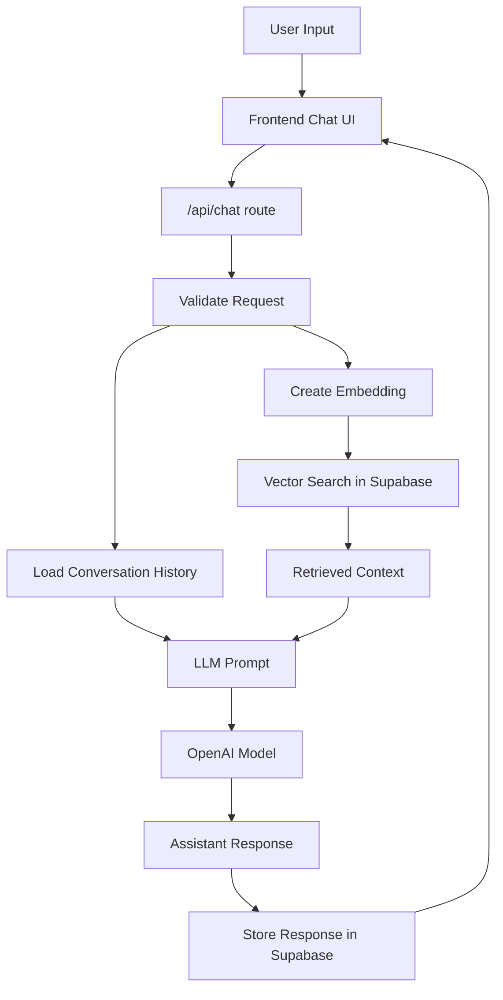

# Tämä dokumentti kertoo chatbotin AI-Timo luomisesta Seminaarityönä

Botti on seminaarityö Haaga-Helian ammattikorkeakoulun kurssille Ohjelmistokehityksen teknologioita (kevät 2026).  
Kurssin sivu löytyy osoitteesta .

Tämän seminaarityön on tehnyt Haaga-Helian opiskelija Timo Lampinen.

**Sisällysluettelo**

- [Chatbot projekti ja sen tarkoitus](#chatbot-projekti-ja-sen-tarkoitus)
- [Käytetyt teknologiat](#käytetyt-teknologiat)
- [Kuinka chatbot toimii](#kuinka-chatbot-toimii)
- [Chatbot tiedostot ja mitä ne tekevät](#chatbot-tiedostot-ja-mitä-ne-tekevät)
- [Tietokanta ja sen toiminallisuudet](#tietokanta-ja-sen-toiminallisuudet)
- &nbsp;&nbsp;&nbsp;&nbsp;[conversations & messages](#conversations--messages)
- &nbsp;&nbsp;&nbsp;&nbsp;[RAG - document_chunks_fin](#rag---document_chunks_fin)
- &nbsp;&nbsp;&nbsp;&nbsp;[matchDocumentChunksFin - SQL tietokantafunktio](#matchdocumentchunksfin---sql-tietokantafunktio)
- [Pohdintaa](#pohdintaa)
- [Lähteet](#lähteet)


## Chatbot projekti ja sen tarkoitus

Tarkoituksenani on rakentaa chatbot Timo, joka toimii portfolio sivullani. Chatbot vastaa kysymyksiin  
kokemuksestani, opiskeluistani, tv-projekteista, koodausprojekteista, minusta sekä tietenkin tämän chatbotin luomisesta.

Valitsin chatbotin, koska halusin oppia käyttämään laajaa kielimallia chatbotin tekemiseen. Samalla voisin saada sivuilleni toimivan elementin, joka myös pystyy antamaan minusta lisätietoa.

## Käytetyt teknologiat

next.js - next.js toimii koko portfolion pohjana  
typescript and tailwind - ohjelmointikieli ja muotoilu  
vercel.com - portfolio pyörii vercel.com palvelun alla ja on ohjattu cname asetuksella verceliin  
Vercel AI SDK - tookit, mitä on käytetty chatbotin rakentamisessa.  
gpt-4o-mini-2024-07-18 - OPENAI kielimalli, jota käytetään luomaan vastaukset
text-embedding-3-small - OPENAI embedding malli, joka muuttaa tekstin numerovektoreiksi. Vektoreita käytetään RAG hakuun
supabase - database, johon tallennetaan RAG tietokanta sekä chatin kysymykset ja vastaukset

**Miksi valitsin nämä teknologiat**

Olin jo tehnyt portfolion käyttäen next.js, supabase, vercel yhdistelmää, joten sain pistettyä enemmän paukkuja itse asiaan, eli chatbottiin. Samassa ympäristössä ne toimivat parhaiten yhteen.  
Samalla typescript ja tailwind olivat tutuiksi.

Lähtiessäni rakentamaan chatbottia, löysin AI Hero videosarjan, jossa opetettiin käyttämään Vercel AI SDK:ta. Koska käytin myös verceliä jo muutenkin alustana, päätin ottaa kyseisen teknologian käyttööni. Kyseinen tutoriaali toimi pääasiallisena lähteenä sovellusta rakentaessa.

Vercel SDK AI tutoriaali AIHero sivuilla https://www.aihero.dev/tool-calls-with-vercel-ai-sdk

Portfolioni käytti jo Supabasea ja kun huomasin sen tukevan RAG tietokantoja. Päätin käyttää Supabasea.

Supabase dokumentaatio  
https://supabase.com/docs/guides/ai  
https://supabase.com/docs/guides/ai/examples/nextjs-vector-search  
  
Valitsin tämän OpenAi kielimallin, koska sen käyttäminen on erittäin halpaa, mutta se pystyy tuottamaan laadukkaita vastuksia. Koin myös järkeväksi opetalla käyttämään kielimallin API rajapintaa. Hinnasta kertoo jotain, että olen käyttänyt tähän mennessä 397 000 tokenia ja se on maksanut 18 senttiä.

OpenAI Developers dokumentaatio  
https://developers.openai.com/api/docs  


## Kuinka chatbot toimii

Yksinkertaistettuna chatbot ottaa vastaan käyttäjän kysymyksen, lataa aiemman kysymyshistorian ja validoi kysymyksen siten, että kysymys on olemassa. Luodaan embedding edellisestä kysymyksestä ja aiemmin muodostetusta embedding mallista. Tehdään RAG haku tietokannasta embeddingin avulla. Syötetään kielimalliin kysymys, kysymyshistoria ja RAG hausta saatu konteksti sekä Prompt, missä on annettu ohjeet vastauksien antamiseen. Kielimalli palauttaa vastauksen, joka näytetään käyttäjälle.

Mermaid malli näyttää hyvin miten prosessi etenee.



## Chatbot tiedostot ja mitä ne tekevät

Kyseessä on myös portfolioni, joten tässä on paljon tiedostoja ja kansioita. Nämä tiedostot ovat käytössä chatbotissa.

Hakemistopolku itsenäiseen chatbot sivuun  
[app/chatbot/](app/chatbot) (klikkaa tiedostonimeä)

<details>
<summary>  
&nbsp;&nbsp;&nbsp;&nbsp;page.tsx  </summary>
Chatbotin oma sivu. Ei sisällä chatbotin toimintalogiikkaa, eikä UI muotoilua. 
</details>
<details>
<summary>
&nbsp;&nbsp;&nbsp;&nbsp;page.moduce.css  </summary>
Ei käytössä
</details>  
    
    
Hakemistopolku frontend komponentteihin  
[components/chatbot/](components/chatbot)
<details>
<summary>
&nbsp;&nbsp;&nbsp;&nbsp;ask.tsx</summary>
Tämä on kysymyslomake, johon käyttäjä kirjoittaa kysymyksen. Palauttaa kysymyksen. Implementoi myös latauksen ajaksi hiukan animoidun tekstin: Hmm...
</details>
<details>  
<summary>&nbsp;&nbsp;&nbsp;&nbsp;ChatbotPanel.tsx </summary>
ChatbotPanel.tsx on chatbotin pääkäyttöliittymäkomponentti. Näyttää otsikon ja disclamerin, renderöi kysymyskentän Ask komponentilla ja välittää viestit ChatMessages komponentille. Käyttää useChatbotConversation hookkia saadakseen viestit ja toiminnot.  
</details>
<details>
<summary>
&nbsp;&nbsp;&nbsp;&nbsp;ChatMessages.tsx  </summary>
Vastaa kysymysten ja vastausten renderöimisestä. Jakaa viestit (messages) kahteen osaan: uusin kysymys/vastaus lihavoituna ja aiemmat normalina tekstinä. Vierittää aina viestikentän loppuun.
 Kutsuu ParseTextToReact, joka muokkaa vastaustekstin luettavampaan muotoon.
</details>
<details>
<summary>
&nbsp;&nbsp;&nbsp;&nbsp;ReactTextParser.tsx   </summary>
Muokkaa vastaustekstit luettavaan muotoon. Osaa lisätä rivinvinvaihtoja joihinkin numeroituihin kohtiin. Tunnistaa lihavoidun tekstin. Palauttaa tekstin < span > sisältönä niin, että muotoilu säilyy paremmin. Tämä komponentti on tehty tekoälyllä.
</details>
<details>
<summary>
&nbsp;&nbsp;&nbsp;&nbsp;useChatbotConversations.tsx </summary>
Tämä on custom hook, joka hoitaa chatbotin tilalogiikan.  
Hakee localstoragesta conversationId:n tai luo uuden. Lataa vanhat viestit GET /api/chat kutsulla. Lähettää kysymyksen POST /api/chat kutsulla. Ylläpitää tiloja, kuten isLoading, messages ja hasSentFirstQuestion.
</details>
<details> 
<summary>
&nbsp;&nbsp;&nbsp;&nbsp;page.module.css  </summary>
Tyylitiedosto, josta käytössä vain .link jota käytetään "Reset chat" napin tyylittelyy.
</details>  
  
  
Hakemistopolku API-route handleriin  
[app/api/chat/](app/api/chat)
<details>
<summary>
&nbsp;&nbsp;&nbsp;&nbsp;route.ts  
</summary>
Tämä on chatbotin API-reitti. Se määrittelee endpointin /api/chat, jota frontend kutsuu. Route.ts tekee kaksi asiaa GET hakee tietyn keskustelun vanhat viestit. POST vastaanottaa käyttäjän kysymyksen ja palauttaa chatbotin vastauksen.
</details>

Hakemistopolku route.ts käyttämiin tiedostoihin  
[lib/chatbot](lib/chatbot)

<details> 
<summary>&nbsp;&nbsp;&nbsp;&nbsp;chat-history.ts  </summary>
chat-history.ts sisältää funktion, jolla haetaan yksittäisen keskustelun aiemmat viestit Supabasesta. Funktio lukee requestista conversationId-parametrin, tarkistaa että se on olemassa, hakee siihen liittyvät viestit messages-taulusta aikajärjestyksessä ja palauttaa ne JSON-muodossa frontendille.
</details>
<details> 
<summary>&nbsp;&nbsp;&nbsp;&nbsp;prompts.ts  </summary>
Muodostaa ja palauttaa system-promptin merkkijonona. Tämä on yksi tärkeimmistä chatbotin toiminnan kannalta. 
Tässä määritellään chatbotin rooli ja identiteetti, keskustelutyyli, kieliohjeet, taustatietoa Timosta, vastausohjeita, rajoitteita ja kieltoja. Lisäksi se lisää promptiin parametrina saadun ragContextin.
</details>
<details> 
<summary>&nbsp;&nbsp;&nbsp;&nbsp;rag.ts  </summary>
   Sisältää funktion jolla haetaan ragMatches supabasesta kutsumalla Supabasen scriptiä match_document_chunks_fin, joka suorittaa vektorihaun tietokannassa. Parametrina annetut queryEmbedding, matchThreshold ja matchCount syötetään scriptin parametreihin. MatchThreshold ja matchCount saavat automaattiset arvot, jos niitä ei anneta haussa. Saatu ragMatches taulukko muutetaan yhdeksi pitkäksi tekstikontekstiksi ragContextiksi kielimallia varten.  
   Tiedostossa on kolme funktiota, joista jokainen kutsuu omaa Supabase rpc-funktiota ja käyttää eri chunk tietokantaa. Nyt käytössä on matchDocumentChunksFin funktio. Muut ovat vielä varmuuden vuoksi täällä, jos haluan kehittää ja päädyn erilaiseen vektoritietokantaan.
</details>
<details> 
<summary>&nbsp;&nbsp;&nbsp;&nbsp;service.ts   </summary>
Tiedostossa on kaksi funktiota parseChatRequest ja createChatAnswer.   
  
parseChatRequest tarkastaa, että conversationId on olemassa ja merkkijono sekä että messages on taulukko eikä tyhjä. Tämän jälkeen se palauttaa conversationId:n ja viimeisimmän viestin, jos viimeisin viesti on käyttäjän lähettämä.

createChatAnswer vastaa kaikesta kielimallille lähetetävän datan keräämisestä ja palauttaa lopuksi vastauksen. createChatAnswer päivittää tai lisää supabaseen conversations taulukkoon conversationId:n. Se lisää käyttäjän viestin messages taulukkoon. Hakee supabasesta kyseisen keskustelun viimeiset 20 kysymystä ja vastausta. Muuttaa haetut messaget käsiteltävään muotoon. Muuttaa käyttäjän viimeisen kysymyksen embedding vektoriksi käyttäen OpenAi:n embedding mallia. Sen jälkeen funktio hakee RAG kontekstin embedding vektorin avulla. Luo vastauksen lähettämällä vanhat viestit, chatPromptin luoman Promptin, missä määritellään tapa keskustella, mistä voi keskustella ja näiden osana saatu ragContext. Lisää vastauksen supabasen messages tauluun. Palauttaa vastauksen.

</details>  


Hakemistopolku type tiedostoihin:  
[types/](types/)  
<details>
<summary>
&nbsp;&nbsp;&nbsp;&nbsp;embedding-types.ts  
</summary>
Sisältää chatbotissa ja RAG-toiminnoissa käytettävät TypeScript-tyypit. Nämä tyypit määrittelevät chat-viestien, komponenttien propsien, request-datan ja vektorihakujen tulosten rakenteen.
</details>  
  

Hakemistopolku embeddingin luoviin scripteihin  
[scripts/](scripts/)  
<details>
<summary>
&nbsp;&nbsp;&nbsp;&nbsp;embedding-document-chunks.ts 
</summary>
Sisältää scriptin, joka hakee ne documentchunkit, joilla ei vielä ole embedding-vektoria, luo niille embeddingit käyttäen OpenAi embeddingmodelia. Lopuksi embeddingit päivitetään takaisin Supabasen tauluhin.
Script ajetaan komentotulkista käskyllä  npm run embed:chunks, koska se on lisätty package.jsoniin käsky "embed:chunks": "tsx scripts/embed-document-chunks.ts".
</details>  


## Tietokanta ja sen toiminallisuudet

Tietokanta Supabasessa on monta taulua chatbotin toiminnallisuuksia  varten.  
- conversations & messages taulut sisältävät kysyttyjä kysymyksiä ja annettuja vastauksia varten. conversations on taulu, minkä mukaan jokainen keskusteluketju on  
- document_chunks_fin RAG tietokanta, mihin on tallennettu tietoja eri aiheista ja aiheille on luotu embedding-vektori
- matchDocumentChunksFin on tietokantafunktio, joka tekee semanttisen samankaltaisuushaun Supabase taulusta document_chunks_fin

#### conversations & messages

conversations taulussa on vain kentät id ja created_at. Created_at on sen vuoksi, että voin jossain vaiheessa alkaa poistamaan vanhimpia keskusteluja.

messages taulussa on tallennettuna kentät id, conversationId, sekä role, content ja created_at. conversationId on sama kuin conversations taulun id. Näitä kysymyksiä haetaan, kun haetaan käytössä olevan keskustelun kontekstia. Toki haetaan aina vain kyseisen conversationId:n 20 viimeisintä viestiä. Eli 10 kysymystä ja 10 vastausta.  Tämän taulun tietoja on mahdollisuus myöhemmin myös analysoida, kun chatbottia halutaan parantaa tai tutkia sen toimintaa.


#### RAG - document_chunks_fin  

Taulu on kolmas, jonka tein tätä projektia varten. Tämäkään ei ole paras mahdollinen, mutta toimii näistä kolmesta parhaiten.  

Taulussa kentät id, document_id, content, metadata, embedding ja created_at.   

metadata kentän tietoja ei tässä ratkaisussa käytetä hyödyksi ollenkaan.  


#### matchDocumentChunksFin - SQL tietokantafunktio  
  
Haun postgresSQL script:   
```   
create extension if not exists vector with schema extensions;  
  
create or replace function match_document_chunks_fin ( 
  query_embedding vector(1536),  
  match_threshold float,  
  match_count int  
)  
returns setof document_chunks_fin  
language sql  
as $$  
  select *  
  from document_chunks_fin  
  where embedding <=> query_embedding < 1 - match_threshold  
  order by embedding <=> query_embedding asc  
  limit least(match_count, 200);  
$$;  
```

Päätin tässä käyttää tuota 1536 vektoriarvoa query_embeddingille, koska käytetty embeddingModel text-embedding-3-small käyttää tuota vektoriarvoa 1536 ja embeddingit on luotu samalla embeddingModellilla.   

## Pohdintaa   

Valitsin chatbotin. Se kuulosti mielenkiintoiselta aiheelta ja siitä voisi olla hyötyä minulle monella tavalla. Ensimmäiset tutkimukseni aiheen tiimoilta myös näyttivät siltä, että tämä ei olisi turhan vaikeaa. Chatbotin rakentaminen olikin haastavampaa kuin odotin. Toisaalta mitään ei saavuta, jos ei aseta tavoitteita tarpeeksi korkealle.  

AI Heron videot antoivat turhan ruusuisen kuvan käytöstä. Totta myös on, että asioiden tekeminen tiettyyn asti on tietyllä tavalla helppoa. Sitten kun mukaan otetaan RAG tietokannat, embeddingit, historiat ja se, että halusin kokonaisuuden myös näyttää järkevältä ja sellaiselta, että sen voi laittaa pyörimään omille sivuille, oli haastetta kunnolla.  

Ensimmäisessä versiossa ja ilman RAG tietokantaa, oli hienoa huomata, että OpenAi api todellakin vastaa kysymykseeni. Nopeasti huomasin, kuinka tärkeä keskusteluhistorian lähettäminen on. Ilman sitä jatkokysymykset käsiteltiin uutena itsenäisenä kysymyksenä. Esimerkiksi (keksityt kysymykset ja vastaukset):    
-  kysymys: Mistä pidät haaga-heliassa?  
-  vastaus: Pidän ohjelmoinnista. Haluatko tietää siitä lisää?  
-  kysymys: Kerro?  
-  vastaus: Mistä haluaisit minun kertovan?  
Eli järkevää keskustelua ja aiempaan viittaamista ei voinut käytää hyväksi. En alunperin ajatellut, että koko historiaa tarvitaan, mutta kävi selväksi, että tarvitaan. Ensin historia olikin vain se mitä tällä kertaa oli kirjoitettu. Myöhemmin kysymysten tallentaminen ja hakeminen tulivat eteen.

Sopivan RAG tietokannan luominen ja sen käyttö on ollut iso haaste. Ehkä se logiikka on jäänyt itselleni hiukan epäselväksi vielä. Nimenomaan siinä mielessä, että mikä olisi tehokkain tapa luokitella asioita ja etsiä kontekstia. Aiheesta saisi tehtyä kokonaan oman seminaarityön. Nyt käytössä oleva tietokanta on kolmas tekemäni tietokanta. Tietokannan tekeminen itsessään on aikaa vievää sekä haastavaa ja se käyttö optimointi vielä haastavampaa. Tällä hetkellä taulukon metadata kenttää, ei käytetä hyväksi haussa. Embedding-vektoreiden avulla haetaan parhaat rivit eli chunkit ja näistä riveistä tehdään haku content:sta, joka sisältää pelkkää tekstiä enemmän kaunokirjallisessa muodossa. Tässä olisi vielä parantamisen varaa.  Tähän se intent haku voisi sopia osaksi. Huomasin, että embedding luonti tietokantaan tapahtuu tämänhetkisillä scripteillä vain kerran. Eli riville lisätty tieto ei päivity, mikäli embeddingiä ei poista välillä. Pitäisi tehdä vielä toinen scripti joka päivittää embeddingit kun se ajetaan.  

Käytin yllättävän paljon aikaa muotoiluihin. Halusin, että tekstikenttä aukeaa vasta, kun ensimmäinen vastaus tulee. Myös se, että viimeisin kysymys&vastaus ovat lihavoituna paransi lukukokemusta. Varsinkin, koska tekstikenttä on vähän pieni vastauksiin nähden. Tekstikenttää olisi tietysti mahdollista suurentaa, mutta haluan mennä nyt näin, kun sivun pitää toimia myös puhelimen näytöllä.  

Promptissa annettavan ohjeistuksen määrittely on tosi tärkeä osa toimivuutta. Kehittäessäni tätä eteenpäin on varmasti vielä tärkeämpää keskittyä promptissa annettaviin tyyli ja rooli ilmaisuihin, kun haluaa saada "oman äänen" chatbotille. Se ei nyt vielä toimi ihan täysin. 

Hallusinointi. Tämä kielimalli hallusinoi välillä aika pahasti. Se on väittänyt suomen katsotuimmaksi dokumentiksi elokuvaa, jota ei ole olemassa. Tätä voisi tietysti vähentää, lähettämällä vatauksen vielä uudestaan kielimallille tarkastettavaksi sopivalla promptilla. Toisaalta hallusinointia ei ole jatkuvast ja uusi tarkastus hidastaisi vastauksia vielä lisää. Nytkin haku kestää melko kauan. 

Refaktorointi. Sitä tein tässä aika paljon ja pyrin jakamaan koodia pienemmäksi luettavuuden parantamiseksi. Olen aiemmin lähes erikoistunut äärimmäisen pitkien kooditiedostojen tekemiseen. Niitä on hankala lukea. Nyt onnistuin aika saamaan pienempiin osiin eri kokonaisuuksia. Aloitin siitä, että itse api/chat/page.tsx ei enää sisällä mitään toimintoja vaan kutsuu ChatbotPanel.tsx. Samalla pystyin lisäämään chatbotin myös portfolioni etusivulle. Pilkoin toimintoja vielä ask.tsx, ChatMessages ja useChatBotConversations tiedostoihin. Sen jälkeen oli route.ts:n vuoro. 
Alunperin route.ts sisälsi kaiken API kutsuihin liittyvän, nyt se on palasteltu 4 eri tiedostoon, joista service.ts createChatAnwer funktion olisi voinut pilkkoa vielä pienemmiksi. Tämäkin oli hyvä alku ja tekee luettavuudesta helpompaa. Olen onneksi lisännyt väliin kommentteja, että pysyn enemmän kärryillä siitä, mitä mihinkin kohtaan on tullut tehtyä. Hassusti kommenttini ovat välillä englanniksi ja välillä suomeksi.  

Minulla kävi hyvä tuuri, sillä olin ilmoittaunut yrityksille tarkoitettuun Haaga-Helian järjestämään AIOps/MLOps työpajaan Making AI software development smooth and scalable. Vaikka siellä käytiin asioita yleisellä tasolla läpi toi Jukka Remeksen esitys minulle monia ajatuksia miten kehittää omaa projektia eteenpäin. Samalla huomasin, että olin myös tehnyt pipelinessa paljon asioita oikein. Luulen, että olin huomannut ilmoituksen tästä työpajasta LinkedIn-sovelluksessa, enkä edes katsonut kovin tarkasti mistä oli kysymys. Onneksi päädyin paikalle. Nyt minulla on olemassa malleja mitä erilaisia ongelmia AI malleihin ja prosesseihin liittyy.


## Lähteet

1. AIHero. Tool Calls with Vercel AI SDK. https://www.aihero.dev/tool-calls-with-vercel-ai-sdk
   Käytetty chatbotin perusrakenteen ja Vercel AI SDK:n opetteluun.

2. Supabase. AI and Vector Search Documentation. https://supabase.com/docs/guides/ai
   Käytetty RAG-ratkaisun ja vektorihakujen toteutuksen tukena.

3. Supabase. Next.js Vector Search Example. https://supabase.com/docs/guides/ai/examples/nextjs-vector-search
   Käytetty Supabasen ja Next.js:n yhteiskäytön hahmottamiseen.

4. OpenAI. OpenAI API Documentation. https://developers.openai.com/api/docs
   Käytetty OpenAI-mallien ja embedding-kutsujen ymmärtämiseen.

