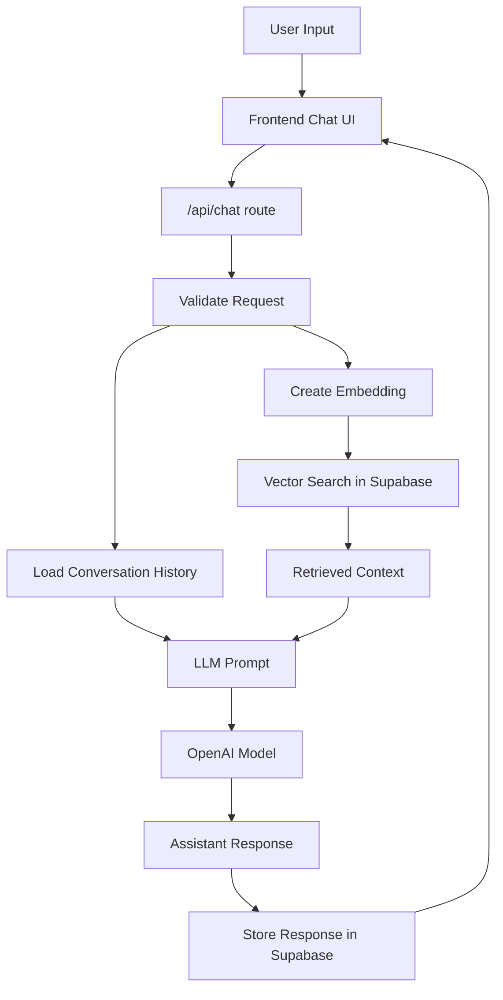

# Tämä dokumentti kertoo chatbotin AI-Timo luomisesta Seminaarityönä  

Botti on seminaarityö Haaga-Helian ammattikorkeakoulun kurssille Ohjelmistokehityksen teknologioita (kevät 2026).   
Kurssin sivu löytyy osoitteesta . 

Tämän seminaarityön on tehnyt Haaga-Helian opiskelija Timo Lampinen.  

Sisällysluettelo 

## Projekti ja sen tarkoitus 
  
Tarkoituksenani on rakentaa chatbot Timo, joka toimii portfolio sivullani. Chatbot vastaa kysymyksiin  
kokemuksestani, opiskeluistani, tv-projekteista, koodausprojekteista, minusta sekä tietenkin tämän chatbotin luomisesta.  

Valitsin chatbotin, koska halusin oppia käyttämään laajaa kielimallia chatbotin tekemiseen. Samalla voisin saada sivuilleni toimivan elementin, joka myös pystyy antamaan minusta lisätietoa.  
  
## Käytetyt teknologiat  
next.js  - next.js toimii koko portfolion pohjana  
typescript and tailwind - ohjelmointikieli ja muotoilu  
vercel.com - portfolio pyörii vercel.com palvelun alla ja on ohjattu cname asetuksella verceliin   
Vercel AI SDK - tookit, mitä on käytetty chatbotin rakentamisessa.  
gpt-4o-mini-2024-07-18 - OPENAI kielimalli, jota käytetään luomaan vastaukset 
text-embedding-3-small - OPENAI embedding malli, joka muuttaa tekstin numerovektoreiksi. Vektoreita käytetään RAG hakuun
supabase - database, johon tallennetaan RAG tietokanta sekä chatin kysymykset ja vastaukset 

**Miksi valitsin nämä teknologiat**

Olin jo tehnyt portfolion käyttäen next.js, supabase, vercel yhdistelmää, joten sain pistettyä enemmän paukkuja itse asiaan, eli chatbottiin. Samassa ympäristössä ne toimivat parhaiten yhteen.  
Samalla typescript ja tailwind olivat tutuiksi.

Lähtiessäni rakentamaan chatbottia, löysin AI Hero videosarjan, jossa opetettiin käyttämään Vercel AI SDK:ta. Koska käytin myös verceliä jo muutenkin alustana, päätin ottaa kyseisen teknologian käyttööni. Kyseinen tutoriaali toimi pääasiallisena lähteenä sovellusta rakentaessa.

Vercel SDK AI tutoriaali AIHero sivuilla https://www.aihero.dev/tool-calls-with-vercel-ai-sdk

Portfolioni käytti jo Supabasea ja kun huomasin sen tukevan RAG tietokantoja. Päätin käyttää Supabasea. 

## Kuinka chatbot toimii  

Yksinkertaistettuna chatbot ottaa vastaan käyttäjän kysymyksen, lataa aiemman kysymyshistorian ja validoi kysymyksen siten, että kysymys on olemassa. Luodaan embedding edellisestä kysymyksestä ja aiemmin muodostetusta embedding mallista.  Tehdään RAG haku tietokannasta embeddingin avulla. Syötetään kielimalliin kysymys, kysymyshistoria ja RAG hausta saatu konteksti sekä Prompt, missä on annettu ohjeet vastauksien antamiseen. Kielimalli palauttaa vastauksen, joka näytetään käyttäjälle.  

Mermaid malli näyttää hyvin miten prosessi etenee.

## Chatbot tiedostot 

Kyseessä on myös portfolioni, joten tässä on paljon tiedostoja ja kansioita. Olen jakanut This is my portfolio also, so it has quite many files/directories.  
These links go straight to the directories about chatbot.  

Hakemistopolku itsenäiseen chatbot sivuun  
[app/chatbot/](app/chatbot)

  
&nbsp;&nbsp;&nbsp;&nbsp;page.tsx  

Chatbotin oma sivu. Ei sisällä chatbotin toimintalogiikkaa, eikä UI muotoilua. 

&nbsp;&nbsp;&nbsp;&nbsp;page.moduce.css  

Ei käytössä

  
  
  
Hakemistopolku frontend komponentteihin  
[components/chatbot/](components/chatbot)

&nbsp;&nbsp;&nbsp;&nbsp;ask.tsx

Tämä on kysymyslomake, johon käyttäjä kirjoittaa kysymyksen. Palauttaa kysymyksen. Implementoi myös latauksen ajaksi hiukan animoidun tekstin: Hmm...

  

&nbsp;&nbsp;&nbsp;&nbsp;ChatbotPanel.tsx 

ChatbotPanel.tsx on chatbotin pääkäyttöliittymäkomponentti. Näyttää otsikon ja disclamerin, renderöi kysymyskentän Ask komponentilla ja välittää viestit ChatMessages komponentille. Käyttää useChatbotConversation hookkia saadakseen viestit ja toiminnot.  

&nbsp;&nbsp;&nbsp;&nbsp;ChatMessages.tsx  

Vastaa kysymysten ja vastausten renderöimisestä. Jakaa viestit (messages) kahteen osaan: uusin kysymys/vastaus lihavoituna ja aiemmat normalina tekstinä. Vierittää aina viestikentän loppuun.
 Kutsuu ParseTextToReact, joka muokkaa vastaustekstin luettavampaan muotoon.

&nbsp;&nbsp;&nbsp;&nbsp;ReactTextParser.tsx   

Muokkaa vastaustekstit luettavaan muotoon. Osaa lisätä rivinvinvaihtoja joihinkin numeroituihin kohtiin. Tunnistaa lihavoidun tekstin. Palauttaa tekstin < span > sisältönä niin, että muotoilu säilyy paremmin. Tämä komponentti on tehty tekoälyllä.

&nbsp;&nbsp;&nbsp;&nbsp;useChatbotConversations.tsx 

Tämä on custom hook, joka hoitaa chatbotin tilalogiikan.  
Hakee localstoragesta conversationId:n tai luo uuden. Lataa vanhat viestit GET /api/chat kutsulla. Lähettää kysymyksen POST /api/chat kutsulla. Ylläpitää tiloja, kuten isLoading, messages ja hasSentFirstQuestion.

 

&nbsp;&nbsp;&nbsp;&nbsp;page.module.css  

Tyylitiedosto, josta käytössä vain .link jota käytetään "Reset chat" napin tyylittelyy.

  
  
  
Hakemistopolku API-route handleriin
[app/api/chat/](app/api/chat)

&nbsp;&nbsp;&nbsp;&nbsp;route.ts  

Vastaa kaiken datan lähettämisestä kielimallille ja vastauksen palauttamisesta frontendiin. 
Data sisältää RAG hauan tiedot, promptin, viestihistorian ja guardrailsit.

  

  
Hakemistopolku route.ts käyttämiin tiedostoihin 
[lib/chatbot](lib/chatbot)

 

&nbsp;&nbsp;&nbsp;&nbsp;chat-service.ts  

 

&nbsp;&nbsp;&nbsp;&nbsp;prompts.ts  

 

&nbsp;&nbsp;&nbsp;&nbsp;rag.ts  

 

&nbsp;&nbsp;&nbsp;&nbsp;service.ts   

 
  
[types/: embedding-types.ts has the different types stored here](types). 
  
[scripts/: embedding-document-chunks.ts has script that turn on creating embedding vectors in Supabase](scripts). 
